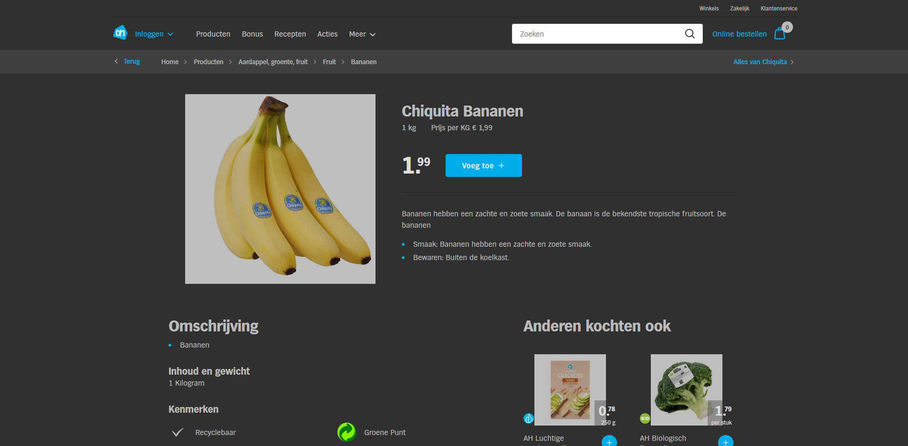

# Dark Albert Heijn

## Preview

## Installation
One click installation is not currently supported.

Manual installation (for [Stylus](https://add0n.com/stylus.html)):  
1: Go to Style Manager.  
2: Create a new style.  
3: Copy and paste the contents from ah-dark.css into the *Code* field.  
4: Apply the style to the domain *ah.nl*.
5: Click Save.

## Notes
I somewhat hastily created this, it is currently incomplete.  
The pages covered so far are:
- Home page
- All products page
- Individual product pages
- Bonus

Unfortunately the product images contain a white background which can't be removed. The best I could do was lower the brightness by 50%.
